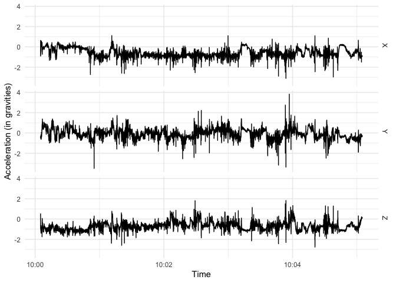
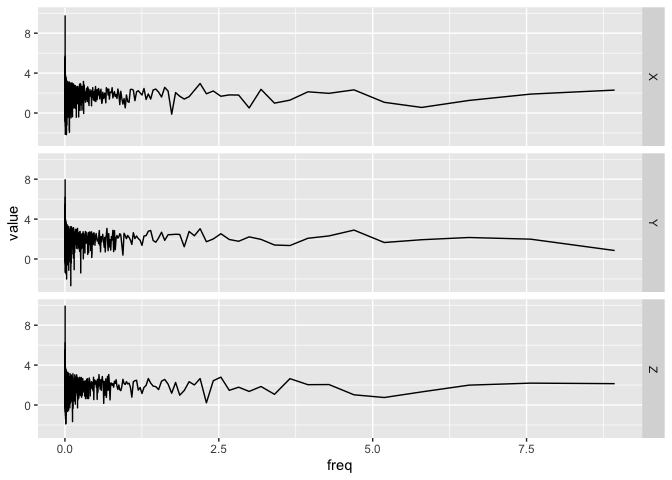

<!-- README.md is generated from README.Rmd. Please edit that file -->

# bis620.2022

<!-- badges: start -->

[](https://github.com/yihan2027/bis620/actions/workflows/R-CMD-check.yaml)
[](https://github.com/yihan2027/bis620/actions/workflows/test-coverage.yaml)
[](https://github.com/yihan2027/bis620/actions/workflows/lint.yaml)
<!-- badges: end -->

Here is the [lint
result.](https://github.com/yihan2027/bis620/actions/workflows/lint.yaml)

The goal of bis620.2022 is to visualize UKBiobank accelerometry data by
time series plot and spectral signature plot.

## Installation

You can install the development version of bis620.2022 from
[GitHub](https://github.com/) with:

``` r
# install.packages("devtools")
devtools::install_github("yihan2027/bis620.2022")
```

## Example

This is a basic example of using `accel_plot()` to draw a time-series
plot of `X`, `Y` and `Z` using UKBiobank accelerometry data.

``` r
library(bis620.2022)
library(lubridate)
#> 
#> Attaching package: 'lubridate'
#> The following objects are masked from 'package:base':
#> 
#>     date, intersect, setdiff, union
library(dplyr)
#> 
#> Attaching package: 'dplyr'
#> The following objects are masked from 'package:stats':
#> 
#>     filter, lag
#> The following objects are masked from 'package:base':
#> 
#>     intersect, setdiff, setequal, union
library(ggplot2)

data(ukb_accel)

dt <- dplyr::first(ukb_accel$time)

ukb_accel |>
  filter(time >= dt  & time < dt + minutes(5)) |>
  accel_plot() +
    theme_minimal() +
    xlab("Time") +
    ylab("Acceleration (in gravities)")
```



This is a basic example of using `spectral_sig()` to get the spectral
signature of accelerometry data.  
The parameter `take_log` decides whether the log of the modulus should
be taken. (Default is `FALSE`)  
The parameter `inverse` decides whether the unnormalized inverse
transform is computed. (Default is `TRUE`)

``` r
library(devtools)
#> Loading required package: usethis
library(lubridate)
library(dplyr)
library(ggplot2)

data(ukb_accel)

dt <- first(ukb_accel$time)

ukb_accel |>
  filter(time >= dt & time < dt + minutes(5)) |>
  spectral_signature(take_log = TRUE, inverse = TRUE) |>
  filter(freq <= 10) |>
  accel_plot()
```


